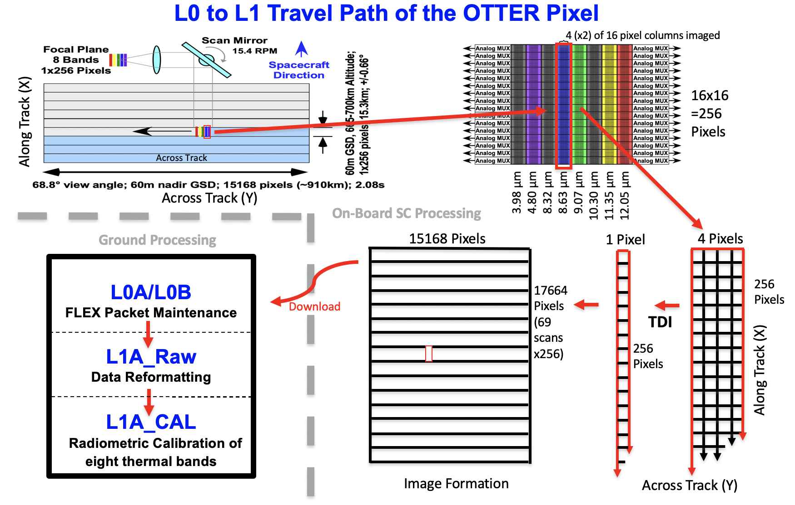
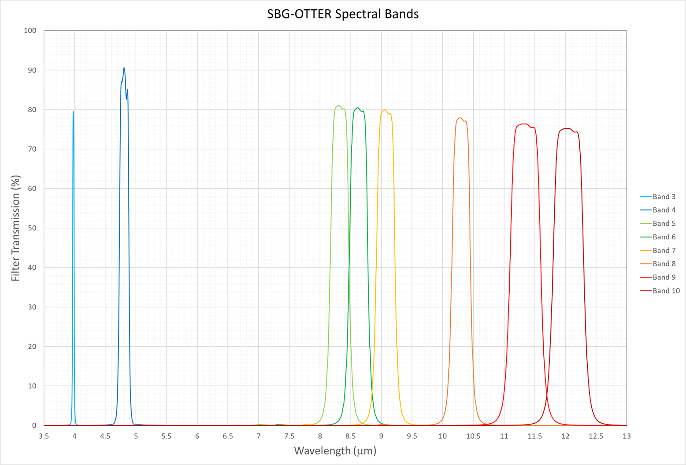
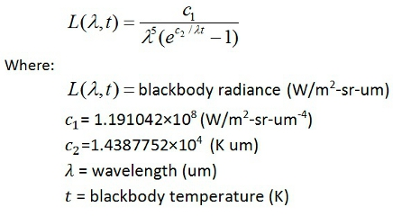
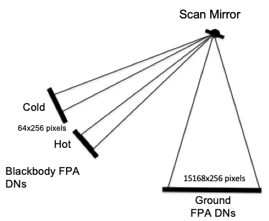
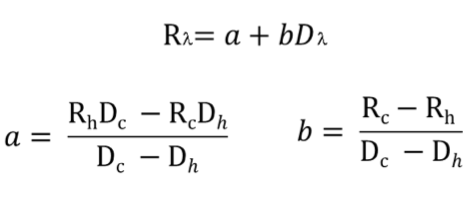
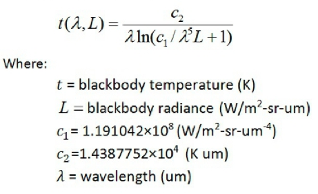

JPL D-110522

**Surface Biology and Geology (SBG)**

**Observing Terrestrial Thermal Emission Radiometer (OTTER)**

**Level 1 Radiometric Calibration Algorithm Theoretical Basis Document
(ATBD)**

Version 0.5

July 26, 2023

Thomas L. Logan

Level 1 Algorithms Team

Jet Propulsion Laboratory

California Institute of Technology

William R. Johnson

Optics and Detector Team

Jet Propulsion Laboratory

California Institute of Technology

National Aeronautics and

Space Administration

Jet Propulsion Laboratory

4800 Oak Grove Drive

Pasadena, California 91109-8099

California Institute of Technology

This research was carried out at the Jet Propulsion Laboratory,
California Institute of Technology, under a contract with the National
Aeronautics and Space Administration.

Reference herein to any specific commercial product, process, or service
by trade name, trademark, manufacturer, or otherwise, does not
constitute or imply its endorsement by the United States Government or
the Jet Propulsion Laboratory, California Institute of Technology.

© 2023. California Institute of Technology. Government sponsorship
acknowledged.

**Change History Log**

| **Revision** | **Effective Date** | **Prepared by** | **Description of Changes** |
|----|----|----|----|
| Draft | 07/26/2023 | T. Logan; W. Johnson | SBG-TIR L1 Calibration ATBD first draft. |
|  |  |  |  |
|  |  |  |  |
|  |  |  |  |
|  |  |  |  |
|  |  |  |  |

# Contacts

Readers seeking additional information about this study may contact the
following:

**Thomas L. Logan  
**MS 168-414  
Jet Propulsion Laboratory

California Institute of Technology  
4800 Oak Grove Dr.  
Pasadena, CA 91109  
Email: *thomas.l.logan@jpl.nasa.gov  
*Office: (818) 354-4032

**William R. Johnson  
**MS 302-205  
Jet Propulsion Laboratory

California Institute of Technology  
4800 Oak Grove Dr.  
Pasadena, CA 91109  
Email: *william.r.johnson@jpl.nasa.gov  
*Office: (818) 393-5470

This Page Intentional Left Blank.

# Abstract / Background

In 2021, the NASA Earth System Observatory (ESO) identified the study of
Surface Biology and Geology (SBG) as one of five science focus areas
based on recommendations from the 2018 Decadal Survey. The concept’s
implementation has since evolved into two separate spacecraft platform
systems: A VSWIR (Visible and Short Wave Infrared imaging spectrometer)
for hyperspectral analysis, and dual VNIR (Visible and Near Infrared)
and TIR (Thermal Infrared) instruments for focused thermal mapping
science \[1\]. This document specifically addresses radiometric
calibration of the SBG-TIR instrument abroad the second platform.
Geometric calibration of the thermal imaging sensor is covered in a
separate ATBD.

The SBG-TIR instrument, also known as “OTTER” (Orbiting Terrestrial
Thermal Emission Radiometer), was designed and built by the Jet
Propulsion Laboratory (JPL). It is mounted to a free-flyer satellite
platform built and managed by the Italian Space Agency (ASI), who also
manages the separate (co-boresighted) VNIR camera. The TIR instrument’s
focus is exploration of the Earth’s surface temperature and emissivity,
evapotranspiration, vegetative water stress, substrate composition,
volcanic plumes, and other high-temperature features and their change
over time. The instrument uses a continuously rotating scan mirror in a
push-whisk configuration to direct light from the telescope through
eight narrowband interference filters to the Focal Plane Array (FPA).
The eight bands include two mid-infrared wavelengths (3-5µm) and six
thermal wavelengths (8-12µm). (The VNIR camera provides three additional
spectral bands managed by ASI.) The platform will have an operational
altitude of ~693km providing an approximate ground sample distance (GSD)
of 60m at nadir, and an image granule size of approximately 910x1060km
with 3-day repeat visit time.

This algorithm theoretical basis document (ATBD) describes the Level 1
radiometric calibration of the SGB-TIR OTTER imagery. The calibration
process involves correcting non-uniform light measurement (as needed)
between individual pixel detectors on the focal plane array (FPA), and
adjusting those values to represent radiometrically correct radiance
values. Radiance is calculated from a two-point linear extrapolation
between coincident measurements from on-board Hot and Cold Blackbodies
for the thermal bands. An additional calibration may be required for the
two mid-wave bands. Based on Laboratory experiments, the radiometric
calibration measured as Brightness Temperature at the Sensor, is
expected to have an accuracy of better than one degree Kelvin (1 sigma
at 300° K).

**Table of Contents**

# 

Contacts [i](#contacts)

Abstract [iii](#abstract-background)

1 Introduction [7](#introduction)

2 Pixel Travel Path and FPA Reserves
[8](#pixel-travel-path-and-fpa-reserves)

3 Algorithm Descriptions [10](#algorithm-descriptions)

3.1 Dark Current Correction [11](#dark-current-correction)

3.2 Flat-Field Uniformity Correction
[11](#flat-field-uniformity-correction)

3.3 Radiometric Calibration [13](#blackbody-radiometric-calibration)

3.3.1 Blackbody Temperature Measurement
[13](#blackbody-temperature-measurement)

3.3.2 Blackbody Conversion to Radiance
[14](#blackbody-conversion-to-radiance)

3.3.3 Blackbody Calibration Files [16](#blackbody-dn-calibration-files)

3.3.4 DN to Radiance Two-Point Conversion
[16](#dn-to-radiance-two-point-conversion)

3.3.5 Radiance to Temperature Conversion
[18](#radiance-to-temperature-conversion)

3.3.6 Mid-Infrared Calibration 19

4 External Dependencies and Potential Issues
[19](#external-dependencies-and-potential-issues)

5 Validation [19](#validation)

6 References [20](#references)

Figures

**Figure 1:** Simplified travel path of an OTTER pixel from photon to
L1A Radiometric Calibration PGE (Product Generation Executive). Only one
band is shown for clarity (actual data flow includes eight interleaved
bands plus Blackbody calibration metada…..9

**Figure 2:** Spectral Response Function for the eight OTTER
Bands………………….….….…..14

**Figure 3:** A Single Scan of the Mirror Images the Earth and two
Blackbodies for each Wavelength………………………………………………………………………………16

Tables

**Table 1:** OTTER Mission Spectral Imaging Parameters…………………………………………7

# Introduction

The OTTER (Orbiting Terrestrial Thermal Emission Radiometer) is part of
the NASA SBG (Surface Biology and Geology) mission that deploys an
advanced imaging spectrometer on a “free-flyer” space platform managed
by the Italian Space Agency (ASI) to monitor Earth environment
temperatures using Thermal Infrared (TIR) wavelengths \[1\]. The planned
science focus includes surface radiance, temperature, emissivity,
evapotranspiration, volcanic plumes, water use efficiency, and related
temperature manifestations. To measure radiance, the instrument uses a
continuously rotating scan mirror in a push-whisk configuration to
direct light from the telescope through eight narrowband interference
filters to the Focal Plane Array (FPA). The focal plane consists of
8x16x256 arrays of Mercury Cadmium Telluride (MCT) detectors of CMOS
(complementary metal oxide semiconductor) manufacture. The OTTER FPA
design is an update of the “Prototype HyspIRI-TIR (PHyTIR)” instrument
originally developed at JPL by Johnson, et al \[2\], and flown by the
NASA ECOSTRESS Mission \[7\] aboard the ISS (International Space
Station). A summary of OTTER spectral imaging parameters are provided as
Table 1.

**Band Center Wavelength Bandwidth Pixel GSD (Nadir):**

**Number (microns) (microns)** 60 x 60m

4 3.98 0.3 **Earth Coverage Image:**

5 4.81 0.15 910 x 1060km

6 8.32 0.3 **Dynamic Range:**

7 8.63 0.3 14bit Integer

8 9.07 0.3

9 10.30 0.3

10 11.35 0.5

11 12.05 0.5

**Table 1: The OTTER Spectral Parameters. Note that Band Numbers 1 to 3
are reserved for use by the three VNIR bands (calibrated separately by
ASI).**

Level-1 (L1) “FPA Calibration” is the process of removing (correcting)
non-uniform light measurement between individual pixel detectors on the
focal plane array. L1 “Radiometric Calibration” is the process of
relating the uniform values received from the focal plane detectors to a
standard measurement. Laboratory testing of the OTTER instrument
indicates that no special light correction steps (FPA calibration) are
anticipated. For visual (VIS), near-infrared (NIR) and shortwave
infrared wavelengths (SWIR), the conventional radiometric calibration
approach is to apply Dark Current and Flat-Field procedures, then
perform a separate vicarious ground calibration. Thermal Infrared (TIR)
imaging systems (such as OTTER) typically have on-board “hot” and “cold”
Blackbody temperature sources to directly calibrate the thermal bands in
orbit. However, the two OTTER mid-infrared wavelengths, which provide a
larger radiance measurement range than the thermal wavelengths, will
require more extensive pre-launch blackbody calibration as well as
on-orbit validation.

Over the lifetime of the instrument, subsequent FPA corrections may be
necessary in the event of non-responsive pixels or Blackbody
degradation. Note that preparations of Level-2 products (i.e., Land
Surface Temperature and Emissivity) require the application of
additional calibration algorithms as described by Hulley and Hook \[3\]
and are outside the scope of this document.

# Pixel Travel Path and FPA Reserves

Unlike the conventional Frame Camera in which the focal plane closely
defines the size of the output image, the OTTER rotating scan mirror
illuminates a relatively small focal plane (1x256 column of pixels) and
combines multiple FPAs to produce a composite image. A single-band L1A
image delivered to the ground is 17664 lines (Y-axis; across-track) by
15168 samples (X-axis; along-track), and is therefore a mosaic of
1,046,592 focal plane columns (15168 columns x 69 scans). The travel
path of a pixel from photon to L1A radiance product is shown in
Figure 1. Each Level-0 image is generated in approximately 2.4 minutes
with eight bands, plus associated Blackbody calibration and related
metadata.

<figure>

<figcaption>
Figure 1: Simplified travel path of an OTTER pixel from
photon to L1A CAL Radiometric Calibration PGE (Product Generation
Executive). Only one band is shown for clarity (actual data flow
includes eight bands plus Blackbody calibration
metadata).
</figcaption>
</figure>

The FPA diagram in (the upper right corner of) Figure 1 shows the eight
available focal plane band/columns. Each of the eight FPA band/columns
is 16 by 256 pixels, with 4 of the 16 pixels columns illuminated. A fast
clock rate and associated settling times require that the immediately
following pixel column be skipped, such that each one of the 4
illuminated pixel columns actually consumes a set of two columns. This
means that only (4x2=) 8 of the 16 pixel columns in each FPA band are
actually used for imaging. The remaining 8 pixel columns represent a
reserve that could be configured for application should the need arise.

For each focal plane column set, a 4x256 14-bit integer “image” is
readout and summed across-track (Time Delayed Integration; TDI) to a
1x256 pixel column image (Figure1; Bottom Right). Each collection of
15168 successive (1x256) pixel columns are concatenated across-track
(one “mirror scan”), with 69 successive scans (along-track) completing
one full image. The resultant image is 15168 samples by 17664 lines (by
8 bands) and is essentially a mosaic of 1,046,592 embedded focal plane
images (per band). The data stream is downloaded to the Ground Data
System (GDS) where the data are organized into Orbit and Scene files
(L0A/L0B PGE) reformatted (L1A RAW PGE), and corrected for timing,
missing, or invalid data. Radiometric calibration (L1A CAL PGE) begins
once the “L1A Raw” process is complete and all the image data are
properly formatted.

# Algorithm Descriptions

The algorithmic processes typically involved with Level-1 optical
satellite calibration include Dark Current (DC) removal and Flat-Field
(FF) uniformity correction for focal plane repair, and some form of
vicarious ground calibration \[5\] for radiometric calibration. For
thermal imaging systems, the radiometric calibration algorithm typically
uses two on-board Blackbodies of different (“hot” and “cold”)
temperatures to interpolate radiance (directly from DNs) that inherently
corrects (and removes the need) for separate DC and FF error
corrections. The two mid-infrared bands will require additional
laboratory measurements to manage their radiance linearity which extends
beyond the range of the two instrument blackbodies. However, in the
(unlikely) event of a blackbody failure, possible approaches for DC and
FF correction are discussed.

## Dark Current Correction

Dark Current (DC) is the sum total of all ambient energy sensed by the
focal plane in the absence of incident light and is typically produced
by electrical fields generated from the sensor’s operating electronics.
DC noise tends to increase with increasing temperature and becomes
significant above 72 degrees Kelvin. The FPA is therefore maintained at
a constant 65K inside a Cryocooler that is further protected by a second
enclosing 120K Cryocooler which combines to significantly reduce DC
error. While the Error Budget estimate for OTTER is not currently
available (2023), the budget prepared for (the very similar) ECOSTRESS
instrument may function as a surrogate. Goullioud \[4\] estimated the
ECOSTRESS Dark Current at 303 electrons/read, which when combined with
other noise errors (Read; Photon; Quantization; Optics thermal) amounted
to less than 0.1K (at 300 Kelvin post TDI). Dark Current will be
measured in the laboratory before launch, calibrated against the
blackbodies after launch, and held in reserve until needed.

> *FP1 = FP0 – DC Dark Current Formula*
>
> *Where:*
>
> *FP0 = Raw Focal Plane image with Dark Current.*
>
> *FP1 = Focal Plane image with Dark Current removed.*
>
> *DC = Focal Plane image of Dark Current.*

## Flat-Field Uniformity Correction

The purpose of Flat-Fielding (FF) is to correct focal plane pixel
artifacts and irregularities relative to a uniform “flat” field of
pixels. For the OTTER thermal bands, this process is inherent in the
radiometric calibration step (where individual pixels are adjusted to
uniformity relative to the two Blackbodies), and is therefore replaced
by that step. However, should it become necessary, the first step would
be to create a Flat-Field calibration file. This is accomplished by
dividing the focal plane’s pixel measurement of a uniform brightness
field by that field’s pixel value (where the “uniform field” is the
image collected in the field or laboratory of a scene at a fixed
integration time or fixed image mean brightness value). The FF
correction is performed on a per-pixel basis (after subtracting the Dark
Current) by dividing the FPA image by the FF calibration file.

> *FFcal = (FF – DC) / UF*
>
> *FP2 = FP1 / FFcal Flat-Field Formula*
>
> *Where:*
>
> *FFcal = Focal Plane Flat-Field Calibration File.*
>
> *UF = Pixel value of the Laboratory-prepared Uniform Field.*
>
> *FF = Focal Plane Image of the Laboratory-prepare Uniform Flat Field.*
>
> *DC = Focal Plane image of Dark Current.*
>
> *FP2 = Flat-Field (and Dark Current) corrected Focal Plane image.*
>
> *FP1 = Focal Plane image with Dark Current removed (from DC Formula).*

In the unlikely event of a degrading Blackbody necessitating a TIR
Flat-Field, a stable thermal mass would be imaged as a replacement for
the Uniform Field (UF), in conjunction with a ground campaign
simultaneously measuring the temperature of that mass. Candidate ground
sites include water bodies and JPL’s vicarious calibration sites \[6\].
Note that the Flat-Field step only corrects FPA artifacts---a separate
radiometric calibration process would still be required (possibly based
on previous black body trending combined with vicarious ground
calibration).

## Blackbody Radiometric Calibration

For the TIR bands, Level-1 Radiometric Calibration is the process of
converting incident thermal energy (in Digital Numbers; DN) on the Focal
Plane to calibrated radiance values (at the sensor). For testing and
evaluation purposes, the radiance values are also converted to
temperature values (degrees Kelvin). This is accomplished through: 1)
Pre-flight and in-flight on-board measurement of the cold (CBB) and hot
blackbody (HBB) temperatures; 2) Conversion of the known blackbody
temperatures to radiance using the Planck function; 3) Creation of hot
and cold focal plane blackbody calibration and radiance files; 4)
Conversion of each focal plane DN to radiance values using a two-point
affine transformation; and 5) Use of the Inverse Planck function to
convert each band’s calculated pixel radiance to Brightness Temperature
(K) for quality control and verification. Based on the ECOSTRESS
experience, this radiometric calibration process should contribute less
than 0.5 degree Kelvin error, and can be further reduced through
corrections derived from validation (cal/val) ground calibration
measurements.

### Blackbody Temperature Measurement

Pre-flight blackbody calibration is performed in the laboratory on the
flight hardware. This is particularly rigorous for OTTER because of
previous experience with the similar PHyTIR \[2\] and ECOSTRESS
instruments. The pre-flight process involves measuring the absolute skin
temperature of each blackbody (BB) using a NIST-traceable radiometer
(National Institute of Standards and Technology) to derive radiance
versus temperature correction factors. A second thermal camera is used
to map spatial gradients in the surface of each BB, although no
gradients (+/- 0.01 degree) have yet to be measured. The final
adjustments (if any) will be measured before flight and provided as part
of the general metadata.

In-flight measurement and monitoring of the blackbodies is performed
through the use of “platinum Resistance Temperature Detectors” (pt-RTDs)
mounted on the backside of each blackbody. Five pt-RTDs are spatially
distributed across each blackbody to accurately capture the
temperatures, which are then downloaded as part of the spacecraft’s
State-Of-Health metadata. The ground calibration process updates the
measured blackbody temperatures approximately once every minute.

Both of the spacecraft’s blackbodies are electrically heated to maintain
a stable temperature throughout the mission. The hot BB is planned for a
constant 328 degrees Kelvin (131F; 55C), and the cold BB is planned to
be a constant 278 degrees Kelvin (41F; 5C).

### Blackbody Conversion to Radiance

The two calibrated Blackbody temperatures are converted to spectral
radiance using the center wavelength of each TIR band in the Planck
function. Figure 2 provides the spectral response functions (SRF) for
the OTTER two mid-infrared and six thermal bands.

**Figure 2: Spectral Response Function (SRF) for the eight OTTER
Bands.**

The Planck function converts blackbody temperatures (K) to spectral
radiance. The standard algorithm is:

*Planck (P) Function*

(Source: WIKI/NOAA)

The Radiance of both the hot (R) and cold
(R) blackbodies are calculated from the In-flight
temperature metadata collected with each image set, which occurs
approximately every 2.4 minutes.

> *Blackbody Radiance Formula*

*Where:*

*R* = *Radiance of the Cold Blackbody*

*R* *= Radiance of the Hot Blackbody*

*P = Planck Function (wavelength specific)*

*T* *= In-Flight collected Cold Blackbody
Temperature (K)*

*T* *= In-Flight collected Hot Blackbody
Temperature (K)*

### Blackbody DN Calibration Files

With each half-rotation of the mirror scan, the focal plane (with 8
filters) collects the digital numbers (DNs) across the cold and hot
blackbodies and the ground image. Sixty-four (64) focal planes are
collected over each blackbody (64x256) and 15168 focal planes are
collected over each Earth image (Figure 3).

**Figure 3: A Single Scan of the Mirror Images two Blackbodies and the
Earth in each Wavelength.**

The 64x256 pixel DN scans of the two blackbodies are appended to the L0
image data for download and later extraction, and 69 scans are combined
to form full blackbody and ground images (69x256=17664 pixels). The 64
pixels in each blackbody DN file are averaged from 64x17664 to 1x17664
pixels to produce very precise DN focal plane measurements that can be
aligned with the single pixel-width radiance images generated in Section
3.3.2.

### DN to Radiance Two-Point Conversion

Given the FPA radiance values (Section 3.3.2) and the corresponding FPA
DNs (Section 3.3.3) for both the cold (278K; 41F; 5C) and hot (328K;
131F; 55C) blackbodies, a two-point affine transformation is performed
that converts each unique input pixel DN from the focal plane directly
to radiance. Dark Current and basic FPA artifacts are implicitly
corrected in the process. The linear fit between the two blackbodies for
each pixel is very precise and will produce very accurate gain and
offset terms. However, calculated radiance values above and below the
two blackbody points will be extrapolations, with increasing error with
increasing distance from the blackbodies. This will be of particular
issue with the mid-IR bands (4 and 5), but will affect all bands to some
degree, especially when imaging cold terrains and very hot events such
as forest fires and lava exposures. Pre-flight calibrations and
validation ground calibrations (Section 5) will be important for
monitoring and adjusting TOA (Top Of Atmosphere) radiance values, with
corrections applied to Level-2 products \[6\] as necessary.

*Two-Point Calibration Formula*

*Where:*

*R = Calculated Radiance of an input Digital Number (DN)*

*a = Offset Term*

*b = Gain Term*

*D = Input Earth Digital Number (DN)*

*R* *= Radiance of the Cold Blackbody (Section
3.3.2)*

*R* *= Radiance of the Hot Blackbody (Section
3.3.2)*

*D* *= Digital Number (DN) from the Cold
Blackbody Calibration File (Section 3.3.3)*

*D* *= Digital Number (DN) from the Hot Blackbody
Calibration File (Section 3.3.3)*

Each full blackbody and ground collection set of 69 scans by 15168 focal
planes (by 8 bands) is imaged every 2.4 minutes. Gain and offset terms
are uniquely calculated for each of the 69 scans and applied uniformly
within each scan. The product of the L1A CAL calibration (Figure 1) are
the Gain and Offset coefficients. In L1B production processing, Gain and
Offset images are created to support the geolocation co-registration
process with orthobase imagery.

### Radiance to Temperature Conversion

For validation purposes, a number of pre-launch test images will be
converted from DN to radiance and brightness temperature (Kelvin) to
verify their accuracy is within 0.5 degree (at 275K). On-orbit TOA
temperature testing will be performed as needed. The conversion from
radiance to temperature is performed using the inverse Planck Function:

*Inverse Planck Function*

 (Source: WIKI/NOAA)

### The temperature validation approach will also be used for pre-launch Saturation Testing, which measures sensor response to the imaging of extreme heat sources. The TIR sensors will be exposed to a laboratory blackbody in the range of 500K, and mid-wave sensors will be exposed to temperatures around 1200K (Lava is typically 1100-1400K). The findings will provide important feedback to the calibration of Level 2 and 3 geologic products. 

### Mid-Infrared Calibration

The two mid-infrared bands are primarily intended for fire and volcanic
heat monitoring that will significantly exceed the temperature range of
the two on-board blackbodies (278-328K). Pre-launch Laboratory blackbody
measurements will be performed to derive two-point Lookup Table (LUT)
gain and offset coefficients that extrapolate beyond the standard
blackbody ranges, and would be updated with blackbody calibrations
obtained after reaching orbit. A similar calibration method for MODIS
Band 21 (3.96µm) found that fixed linear radiance coefficients could be
derived for accurate fire detection \[8\]. Alternatively, it may be
possible to acquire laboratory blackbodies with extended temperature
endpoints in the range of 450K to 750K, and perform direct pre-launch
calibration measurements. Either way, in-flight mid-wave calibration
coefficients may be monitored and improved through feedback from
on-going Level-2 atmospheric-corrected products (e.g., Land Surface
Temperature), vicarious ground validation data collection \[9\], and/or
on-board (limited range) blackbody testing.

# External Dependencies and Potential Issues

There are no external data dependencies for Level-1 Radiometric
Calibration of the eight OTTER thermal bands. The joining of ASI’s VNIR
bands 1, 2, and 3 with the OTTER bands 4-11 occurs after both sensor
bands have been independently and separately calibrated.

# Validation

Radiometric thermal calibration techniques have been extensively tested
and validated in the laboratory as part of the earlier PHyTIR instrument
program \[1\] and in-flight by the ECOSTRESS mission \[3\]. For
ECOSTRESS, this included extensive on-orbit skin temperature
measurements of large stable lakes (i.e., Lake Tahoe; Salton Sea)
compared with sensor radiance measurements \[6\]. Similar on-orbit tests
will be performed as appropriate to validate OTTER mission sensors, as
well as various integrated instrument and ground data processing
activities performed by SBG/OTTER scientists.

# References

\[1\] Basilio, R.R., S.J. Hook, S. Zoffoli, and M.F. Buongiorno, 2022.
“Surface Biology and Geology (SBG) Thermal Infrared (TIR) Free-Flyer
Concept,” <u>2022 IEEE Aerospace Conference (AERO)</u>, Big Sky, MT,
USA, 9 pages.

\[2\] Johnson, W.R., S.J. Hook, M. Foote, B.T. Eng, and B. Jau, 2014.
“Characterization and Performance of the Prototype HyspIRI-TIR (PHyTIR)
Sensor,” <u>Proceedings of SPIE</u>, Vol. 9222, 922208, 12 pages.

\[3\] Hulley, G.C., and S.J. Hook, 2015. “ECOSTRESS Level-2 Land Surface
Temperature and Emissivity Algorithm Theoretical Basis Document (ATBD),”
NASA/Jet Propulsion Laboratory internal ECOSTRESS Project Document,
California Institute of Technology, 103 pages.

\[4\] Goullioud, R., 2015. “ECOSTRESS_Error_Budget_2015-04-08.xlsm,”
NASA/Jet Propulsion Laboratory internal ECOSTRESS Project Document,
California Institute of Technology.

\[5\] Helmlinger, M.C., C.J. Bruegge, E.H. Lubka, and H.N. Gross, 2007.
“LED Spectrometer (LSpec) Autonomous Vicarious Calibration Facility.”
<u>Proceedings of SPIE</u>, Vol. 6677, 10 pages.

\[6\] Hook, S. J., Cawse-Nicholson, K., Barsi, J., Radocinski, R.,
Hulley, G. C., Johnson, W. R., et al., 2020. In-Flight Validation of the
ECOSTRESS, Landsats 7 and 8 Thermal Infrared

Spectral Channels Using the Lake Tahoe CA/NV and Salton Sea CA Automated
Validation

Sites. <u>IEEE Transactions on Geoscience and Remote Sensing</u>, 58(2),
1294-1302.

\[7\] NASA/JPL ECOSTRESS (ECOsystem Spaceborne Thermal Radiometer
Experiment on Space Station) website. <https://ecostress.jpl.nasa.gov/>

\[8\] Xiong, X., A. Wu, B. N. Wenny, S. Madhavan, Z. Wang, et al., 2015.
Terra and Aqua MODIS Thermal Emissive Bands On-Orbit Calibration and
Performance. <u>IEEE Transactions On Geoscience and Remote Sensing</u>,
53(10), 5709-5721.

\[9\] Hook, S. J., W. Clodius, L. Balick, R. Alley, A. Abtahi, R.
Richards, S. G. Schladow, 2005. In-Flight Validation of Mid- and Thermal
Infrared Data From the Multispectral Thermal Imager (MTI) Using an
Automated High-Altitude Validation Site at Lake Tahoe CA/NV, USA.
<u>IEEE Transactions On Geoscience and Remote Sensing</u>, 43(9),
1991-1999.
