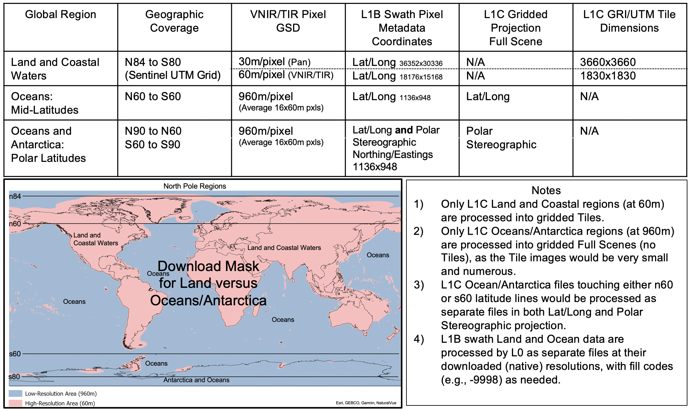

# SBG-TIR OTTER Level 1 Brightness Temperature

This will be the repository for the Surface Biology and Geology Thermal Infrared (SBG-TIR) OTTER radiance and brightness temperature data product algorithm. (NPO 52805-CP)

This algorithm will utilize the [VICAR](https://github.com/NASA-AMMOS/VICAR) image processing framework.

The SBG collection 1 level 1 brightness temperature data product is being developed based on the [ECOsystem Spaceborne Thermal Radiometer Experiment on Space Station (ECOSTRESS) collection 3 level 1 radiance data product](https://github.com/ECOSTRESS-Collection-3/ECOv003-L1-RAD).

Mike M. Smyth (he/him) 
[mike.m.smyth@jpl.nasa.gov](mailto:mike.m.smyth@jpl.nasa.gov) 
NASA Jet Propulsion Laboratory

Thomas L. Logan (he/him) 
[thomas.l.logan@jpl.nasa.gov](mailto:thomas.l.logan@jpl.nasa.gov) 
NASA Jet Propulsion Laboratory

William Johnson
[William.R.Johnson@jpl.nasa.gov](mailto:William.R.Johnson@jpl.nasa.gov) 
NASA Jet Propulsion Laboratory 329F

## 1. Introduction

### 1.1. Identification
This is the Preliminary Product Specification Document (PPSD) for Level 1 (A/B/C) data products of the NASA/JPL Surface Biology and Geology (SBG) Thermal Infrared (TIR) mission (aka “OTTER”). SBG-TIR L1 products provide corrected spacecraft attitude, calibrated at-sensor radiances and geolocation tags for pixel data acquired by the SBG-TIR radiometer instrument according to the algorithms described in the SBG-TIR L1 Geolocation Algorithm Theoretical Basis Document (ATBD) and the SBG-TIR L1 Calibration ATBD.

### 1.2. Purpose and Scope

The PPSD is an initial “Phase C” version of the Product Specification Document (PSD), describing the Standard and Low Latency Level 1 radiance, geolocation, and attitude products to be generated by the JPL SBG-TIR Science Data System (SDS). Preliminary descriptions are largely based upon TIR product knowledge and experiences obtained through the ECOSTRESS Mission (https://ecostress.jp.nasa.gov). The SGB-TIR mission is a cooperative effort with the Italian Space Agency (Agenzia Spaziale Italiana; ASI), which produces SBG-TIR platform metadata and three Visual and Near-Infrared (VNIR) bands. Descriptions of ASI L1 products as well as SBG-TIR Level 2, 3, and 4 products are covered in separate documents.

### 1.3. Mission Overview

NASA’s SBG mission is a “Designated Observable” (DO) identified in the National Academies of Sciences, Engineering and Medicine (NASEM) 2017 Decadal Survey. The Decadal Survey document presented a vision for combining the roles of visible-to-shortwave infrared imaging, spectroscopy, and multispectral or hyperspectral thermal infrared image data, in addressing terrestrial and aquatic ecosystems and other elements of biodiversity, geology, natural hazards, the water cycle, and applied sciences topics relevant to many areas with societal benefits. To best address the topics areas, the SBG mission has been divided into two separate satellite platforms, supporting 1) hyperspectral shortwave (SWIR) collections, and 2) multispectral thermal (TIR) collections.

The SBG-TIR portion of the mission includes the thermal infrared multispectral instrument, also known as OTTER (Orbiting Terrestrial Thermal Emission Radiometer), is built by the NASA Jet Propulsion Laboratory. The OTTER platform and VIREO (Visible InfraRed Earth Observing) camera subsystem are built by Italian Space Agency (Agenzia Spaziale Italiana; ASI). OTTER instruments will measure the emitted radiance of the Earth surface to better understand the dynamics of Earth’s changing surface geology and biology, focusing on ground/water temperature, snow reflectivity, active geologic processes, vegetation traits, and algal biomass. The collective SBG-TIR mission addresses these dynamic issues by accurately measuring the emitted radiance of Earth’s surface in the visual-infrared (VNIR), mid-infrared (MIR), and thermal-infrared (TIR) spectral regions using the two multispectral radiometers. The TIR instrument measures radiance data in eight spectral bands from 3.95 to 12.05 μm with approximately 60 meter spatial resolution at nadir and a nominal revisit time of 3 days at the equator. The VNIR instrument provides red (0.655 μm) and near-infrared (0.835μm) spectral bands at matching 60m resolutions, plus a third high resolution 30m/pixel panchromatic band (600-900μm).

### 1.4. Applicable and Reference Documents

“Applicable” documents levy requirements on the areas addressed in this document. “Reference” documents are identified in the text of this document only to provide additional information to readers.  Unless stated otherwise, the document revision level is “Initial Release.”  Document dates are not listed, as they are redundant with the revision level.

#### 1.4.1. Applicable Documents

1.  SBG-TIR Project Science Data System Requirements (TBD).

2.  SBG-TIR Science Data Management Plan (TBD).

3.  ICD Between SBG-TIR SDS and LPDAAC (TBD).

4.  SBG-TIR Level 1 Radiometric Calibration Algorithm Theoretical Basis
    Document. JPL D-110522 (26JUL2023).

5.  SBG-TIR Level 1 Geometric Calibration Algorithm Theoretical Basis
    Document. JPL D-110523 (02SEP2024).

6.  ICD Between SBG-TIR SDS and ASI-VNIR SDS (TBD).

#### 1.4.2. Reference Documents

1.  2017-2027 Decadal Survey for Earth Science and Applications from
    Space (ESAS 2017)

> TBD

### 1.5. SBG-TIR Data Products

SBG-TIR data processing is divided into “Levels” corresponding to product maturity. Level 0 (raw) data primarily consist of spacecraft packets that have been pre-processed by the Ground Data System (GDS). Level 1 provides calibration and geolocation products, including spacecraft engineering data, time-tagged raw sensor pixels (appended with their radiometric calibration coefficients), black body pixels (used to generate the calibration coefficients), geolocated and radiometrically calibrated at-sensor radiances and brightness temperature, and corrected spacecraft attitude data.  Level 2 provides scientific-ready products such as the land surface temperature (LST) and emissivities of each spectral band retrieved from the at-sensor radiance data, and a cloud mask. Level 3 and L4 are more advanced scientific products derived from Level 2 and external ancillary data. A summary Product Grouping list is shown in Table 1-1.

Table 1-1: SBG-TIR Product Groups
![media/image8.png]

#### 1.5.1. SBG-TIR Data Products

SBG-TIR Level 1 consists of three sub-parts A, B, and C. L1A is responsible for Radiometric Calibration involving the conversion of spectral DN to radiance. Radiance gain and offset coefficients for each spectral band are calculated and delivered to L1B, as described in the  L1 Radiometric Calibration ATBD. L1A outputs are primarily engineering and archive products, and are not generally intended for public consumption.

L1B applies the L1A radiance coefficients to each spectral band, then performs a Geometric calibration using ASI-corrected spacecraft altitude/ephemeris, DEM (elevation), and a map-referenced global orthobase, to calculate the precise map coordinate for each spectral pixel and insure the alignment of TIR images with VNIR image products. The process is described in the L1 Geometric Calibration ATBD. L1B products are swath-based, calibrated Top-of-Atmosphere (TOA) radiance products (Radiance at Sensor), with precise pixel-level geolocation. Swath pixel alignments are closest to the original sensor collection. These scenes consist of 71 concatenated along-track scans (with each scan 256 lines by 15168 sample pixels) of the instrument mirror. Each scan requires approximately 0.38489 seconds of imaging time followed by 1.62811 seconds of travel time to the next scan-start position (2.013seconds total), producing a full image (granule) containing 18176 lines by 15168 samples with ~1 pixel scan overlap (at nadir) in 143.0 seconds. The resulting image granules cover approximately 985km swath width by 981km swath length. Each of the 14-15 daily orbits start at the equatorial crossing of the ascending SBG-TIR platform’s orbit (~12:30 pm local time). The subsequent L1B product contains up to eight MIR and TIR swath radiance bands geolocated with matching latitude and longitude pixel metadata files, providing foundational radiometric and georeferenced spectral inputs for Level 2+ science products. Note that L1B imagery are downloaded at 60m/pixel resolution for Land and Coastal areas, but most of the global Oceans and Antarctica are averaged (on-board) and downloaded at 960m/pixel. Different region/resolution images are stored in L1B as separate files with a “fill code” for dis-similar resolution data.

L1C products include two mid-wave bands (MIR) and six TIR wavelengths converted from L1B TOA Radiance (RAS) to TOA Brightness Temperature (BT) providing a total of eight L1C TIR products (ASI VNIR products are separate). L1C products differ significantly from L1B in that they are gridded (resampled) to a map projection. Generally, users focused on spectral accuracy would use the (unresampled) L1B products provided in NetCDF format. L1C gridded products are provided in Cloud Optimized GeoTIFF (COG) format which makes them convenient for direct use with geographic information systems. L1C gridded products will also come in different pixel resolutions due to on-board pixel averaging. Each along-track scan (defined above) is checked against an on-board “Land/Water ask” (Figure 1-0). 100% “water” scans and most of Antarctica are treated the same and averaged to 960m pixels. A scan with (at least) one “land” mask pixel will be downloaded at the nominal 60m/pixel resolution (including a few special 60m “land” sities in Antarctica). During ground processing, when the 71 scans are combined into a full scene, variable resolution scans are expected to be provided as multiple separate L1B layers, but for L1C, Land and Coastal areas will be gridded into 60m Tiles with NaNs for non-land scans, and the Oceans/Antarctica products will be gridded as Full Scenes with all data (including land) resampled to 960m. To reduce the geometric distortions associated with latitude, Land and Coastal collections imaged at 60m pixel resolution will be gridded as L1C “Tile” products in UTM projection. These approximate 110x110km tiles follow the “Sentinel-2 Tiling Grid” design which divides the world (n84 to s80) into 60 separate projection zones (each +/-6 degrees of the Zone’s Central Meridian) to preserve shape across latitudes. However, 960m Ocean and Antarctica imagery will not follow the “Tile” scheme because of their low resolution (and subsequent small size), and will be provided as full scenes. These gridded full scenes will utilize the Geographic (Latitude/Longitude) projection except at the poles where they will be provided in Polar Stereographic projection. Ocean/Antarctica images crossing the n60/s60 latitude transition boundaries will be processed in both projections. Associated polar metadata coordinate files will be provided in both Polar Stereographic (Northings/Eastings) and Latitiude/Longitude coordinates. See Section 3 for detailed descriptions of the Level 1 products. 

Figure 1-0: SBG-TIR L1B/L1C Image Sizes and Mask

{width="6.5in" height="3.85625in"}

#### 1.5.2. ASI-Supplied Inputs to Level 1 TIR

The Italian Space Agency (Agenzia Spaziale Italiana; ASI) manages the SBG-TIR spacecraft platform and Visual Near-Infrared (VNIR) instrument co-boresited with the JPL-built and managed TIR instrument. ASI provides GRI-corrected orbital and geolocation (attitude and ephemeris) metadata (for L1B products), plus their L1B/L1C VNIR 30m and 60m radiance products. The expected daytime inputs (and day/night platform metadata) from ASI include:

-   Platform Uncorrected and Corrected Ephemeris and Attitude Metadata
    (Day/Night)

    -   Attitude/quaternion

    -   Attitude/time_j2000

    -   Ephemeris/eci_position

    -   Ephemeris/eci_velocity

    -   Ephemeris/time_j2000

    -   Quaternion Format: "NAIF/SPICE"

-   Orbital GRI-Corrected Ephemeris and Attitude/Timing Metadata (Day)

    -   Attitude/quaternion

    -   Attitude/time_j2000

    -   Ephemeris/eci_position

    -   Ephemeris/eci_velocity

    -   Ephemeris/time_j2000

    -   Quaternion Format: "NAIF/SPICE"

-   VNIR Camera Model (for reference)

-   VNIR Level 1B Radiance (Geolocated; Swath format) -- NetCDF format

    -   Three daytime TOA Radiance Bands (30m PAN and 60m VNIR
        resolution)

-   VNIR Level 1B Geolocation Swath Metadata -- NetCDF format

    -   Latitude; Longitude; Elevation/Height; Pixel Time of Acquisition
        (or equivalent)

-   VNIR Level 1C Radiance (Geolocated; Map Projected format) -- GeoTIFF
    Images

    -   Three daytime TOA Bands (30 and 60m resolution) gridded images
        and tiles

-   VNIR Level 1C Tile and Scene Metadata -- GeoTiff auxillary format

#### 1.5.3. Level 1 Standard Day, Night, and Low Latency Products

The three ASI-provided VNIR radiance bands will only be generated during the day. The daytime “Standard” products are expected to be processed and delivered within 72 hours of their collection. However, a special subset of L1 products will be generated within 24 hours of collection to meet special time-critical science requirements. These “Low Latency” products will be processed using separate ASI and JPL production lines, and will not include VNIR inputs. Therefore, they will differ slightly from the subsequent Standard products, and may not be archived after serving their short-term purposes. In addition, SBG-TIR nighttime products will not contain the 10.3µm TIR band (due to download volume restrictions). Figure 1-1 shows the Standard processing flow for SBG VNIR and TIR L1 standard daytime products, and can be compared with the equivalent Low Latency product flow (Figure 1-2).

Figure 1-1: SBG-TIR Level 1 Standard Products Data Flow

![media/image6.png]

Figure 1-2: SBG-TIR Level 1 Low Latency Products Data Flow

![media/image2.png]

Table 1-2 provides a summary of the interplay between Standard and Low Latency products and Day versus Night processing. In addition, the following comments are provided for clarification:

-   SBG-TIR L1B and L1C do *not* contain VNIR images.

-   L1C Standard Daytime products are spatially aligned with VNIR data
    (but Not L1C Night or Low Latency products).

-   L1B contains (and L1C inherits) orbital correction metadata from ASI
    for Standard Daytime products, but not for Night or Low Latency
    products.

-   L1B Night/Low Latency geolocation will use a derivative of the JPL
    Landsat7 TIR orthobase (as aligned/enhanced to match the European
    Sentinel-based Global Reference Image), while ASI will use the
    Sentinel GRI RED band for its' daytime VNIR processing.

> Table 1-2: Standard and Low Latency Product Comparison

![media/image3.png]

#### 1.5.4. Level 1 Intermediate and Distributable Products

In addition to the previously discussed L1B and L1C products, there are a number of intermediate files. For example, the L1A_RAW_PIX and L1A_BB files are scene-specific extracts of orbital spectral and metadata designed for input to the L1A Calibration PGE. In turn, the L1A PGE outputs the L1A_PIX archive file containing all pre-processed calibration inputs ready for any future re-calibration. Table 1-3 provides a summary of Level 1 intermediate and distributable products.

Table 1-3: Level 1 Intermediate and Distributable Products
| **Product type** | **Description** |
| --- | --- |
| L1A_ENG | Spacecraft orbital and instrument engineering data, including blackbody gradient coefficients and orbital timing |
| L1A_BB | Scene-specific instrument blackbody calibration pixels and timing |
| L1A_RAW_PIX | Scene-specific raw pixel spectral band data  |
| L1A_PIX | Archive of all scene-specific inputs pre-processed as required for radiometric calibration, including raw pixel spectral band data, matching high/low blackbody pixels and temperature (Kelvin) values |
| L1A_RAW_ATT | Scene-specific raw attitude and ephemeris data |
| L1A_RAD_GAIN | Radiance gain and offset coefficients for each band |
| L1B_GEO | Swath image geolocation-tagged files, including latitude, longitude, height, sun angles, look angles, and related ancillary data. |
| L1B_RAD | Swath image radiometrically corrected radiance pixels, matched with L1B_GEO geolocation tags; 8 Radiance and data quality bands |
| L1B_ATT | Corrected spacecraft ephemeris and attitude data |
| L1C_GRID | Gridded L1B Radiance converted to Brightness Temperature; Full image in lat/long (or polar) projection; 960m resolution; Eight BT and Data Quality bands |
| L1C_TILE | Gridded L1B Radiance converted to Brightness Temperature; Image subdivided as per Sentinel UTM Tiling system; 60m resolution; Eight BT and Data Quality bands |

#### 1.5.5. Level 1 PGE Overview

Level-1 products are produced in a series of PGE (Product Generation Executive) steps as shown in Figure 1-3. The L1A_RAW PGE is responsible for extracting raw spectral density numbers (DN), blackbody DNs, and blackbody temperatures from orbital stream data into scene-specific files. The L1A_CAL PGE  pre-processes raw scene-specific inputs into a calibration-ready form for (1) DN-to-Radiance calibration (see L1 Calibration ATBD) and (2) archiving (L1A_PIX; Table 3-11). Output radiance gain and offset coefficients are passed via the L1A_RAD_GAIN file (Table 3-13) to the L1B PGE. Note that L1A image bands are not co-registered  (pixel-aligned) at this stage of processing. Band alignment (a minor polynominal adjustment) occurs along with other L1B pre-processing steps to align swath lines in a consistent manner. The L1B PGE then geolocates each individual swath radiance pixel and outputs matching Latitude and Longitude (and other) swath raster files. This geolocation process involves creating an intermediate geographic-projected (gridded) radiance file using the camera model, corrected ephemeris from ASI (Section 1.5.2) and/or the local TIR platform metadata, digital elevation model (DEM), and TIR orthobase (for co-registration matching). The swath radiance bands are output in the L1B_RAD product file (Table 3-4) with the matching swath geolocation (latitude and longitude) data output in the L1B_GEO product file (Table 3-7). These products are finally combined and gridded to 60 meters/pixel and output via the L1C_GRIDDING PGE as COG (Cloud Optimized GeoTiff) files.

Figure 1-3: SBG-TIR Level 1 PGE Product Data
![media/image4.png]

## 2. Data Product OrganIzation

### 2.1.Distributed File Formats

SBG-TIR image products are distributed in either of two formats: “Network Common Data Form 4” (netCDF-4), or “Cloud-Optimized GeoTIFF” (COG). Only the L1A, L1B and L2 swath products are provided in netCDF format as these foundational products are primarily intended for long-term scientific archiving. Most users are expected to utilize L1C and L2-L4 products in the map-projected (gridded) COG format.

#### 2.1.1. NetCDF4 Format

“NetCDF (Network Common Data Form) is a set of software libraries and machine-independent data formats that support the creation, access, and sharing of array-oriented scientific data.” The format is managed by Unidata for the University Corporation for Atmospheric Research (NCAR), https://www.unidata.ucar.edu/software/netcdf/, and extensively documented in the NetCDF Users Guide at https://docs.unidata.ucar.edu/nug/current/index.html. NetCDF files have the “.nc” file extension, and are compatible with a number of common access tools including NetCDF Viewer, Panoply, ArcGIS, Python (netCDF4-python; PyNIO module), and others. Many linux systems also have the command line “ncdump -h file.nc” tool installed. NetCDF4 filed also contain extensive metadata as described  (by product file) in Section 3.

#### 2.1.2. COG Format

Analysis-ready SBG products are distributed in a gridded and tiled form using the COG (Cloud Optimized GeoTiff) format https://www.cogeo.org/. While COG files are typically larger than regular GeoTIFF files, they have the ability to adjust viewing scales and more efficiently stream only the required portions of an image file. COG files use the same “.tif” suffix as regular GeoTiff files.

SBG L1CG gridded products are COG-formatted multi-band files in latitude/longitude map-projection. SBG L1CT files are COG-formatted image sub-tiles based on a modified form of the  Military Grid Reference System (MGRS) tiling scheme as defined by NASA (https://hls.gsfc.nasa.gov/products-description/tiling-system/) and the ESA Sentinel-2 UTM grid (https://eatlas.org.au/data/uuid/f7468d15-12be-4e3f-a246-b2882a324f59). These tiles divide Universal Transverse Mercator (UTM) zones into square tiles 109800 m across, using a 60m cell size with 1830 rows by 1830 columns, totaling ~3.35 million pixels per tile. This allows the end user to assume that each 60 meter SBG pixel will remain in the same location at each timestep observed in analysis. The COG format also facilitates end-user analysis as a universally recognized and supported format, compatible with open-source software, including QGIS, ArcGIS, GDAL, the Raster package in R, rioxarray in Python, and Rasters.jl in Julia.

Each SBG gridded or tiled COG product additionally contains a rendered browse image in GeoJPEG format with a .jpeg extension. This image format is universally recognized and supported, and the files are compatible with Google Earth. Each collection of tiled files also includes a separate .json file containing the Product Metadata and Standard Metadata in JSON format for the parent image granule. 

## 3. SBG-TIR Product Files

### 3.1. Product File Name Format

Product file names will have the form (TBD):
<SBG_Name>_<PROD_TYPE>_<OOOOO>_<SSS>_<YYYYMMDD>T<hhmmss>_<BBbb>_<VV>.<TYPE>

Where:
SBG_Name: SBG-TIR name designation (TBD)
PROD_TYPE:  L1A/L1B products; Example=L1B_RAD
OOOOO:  Orbit number; starting at start of mission, ascending equatorial crossing
SSS:  Scene ID; starting at first scene of each orbit
YYYYMMDD:  Year, month, day of scene start time
hhmmss:  Hour, minute, second of scene start time
BBbb:  Build ID of software that generated product, Major+Minor (2+2 digits)
VV:  Product version number (2 digits)
TYPE:  File type extension=
nc or tif for the data file
nc.met or tif.met for the metadata file.

Band Ordering of L1A_PIX, L1A_BB, L1B_RAD L1CG, L1CT data:
	B1_03980	MIR_Radiance  (3.98 µm
	B2_04800	MIR_Radiance  (4.80 µm)
	B3_08320	TIR_Radiance  (8.32 µm)
	B4_08630	TIR_Radiance  (8.63 µm)
B5_09070	TIR_Radiance  (9.07 µm)
B6_10300	TIR_Radiance  (10.30 µm; Daytime Only)
B7_11350	TIR_Radiance  (11.35 µm)
B8_12050	TIR_Radiance  (12.05 µm)

### 3.2. Swath Standard Metadata (NetCDF-4)

Each SBG swath product in NetCDF format will contain at least 3 groups of data:  A standard metadata group that specifies the same type of contents for all products, a product specific metadata group that specifies those metadata elements that are useful for defining attributes of the product data, and the group(s) containing the product data.  

Table 3-1 provides the standard metadata for L1B_RAD and L1B_GEO products. This may vary for other L1 products and as well as L2+ products. The standard metadata consists of the following:

Table 3-1: Standard Product Metadata
| **Name** | **Type** |
| --- | --- |
| AncillaryInputPointer | string |
| AutomaticQualityFlag | string |
| AutomaticQualityFlagExplanation | string |
| BuildID | string |
| CRS | string |
| CampaignShortName | string |
| CollectionLabel | string |
| DataFormatType | string |
| DayNightFlag | string |
| EastBoundingCoordinate | float |
| FieldOfViewObstruction | string |
| ImageLines | float |
| ImageLineSpacing | integer |
| ImagePixels | float |
| ImagePixelSpacing | integer |
| InputPointer | string |
| InstrumentShortName | string |
| LocalGranuleID | string |
| LongName | string |
| NorthBoundingCoordinate | float |
| PGEName | string |
| PGEVersion | string |
| PlatformLongName | string |
| PlatformShortName | string |
| PlatformType | string |
| ProcessingEnvironment | string |
| ProcessingLevelDescription | string |
| ProcessingLevelID | string |
| ProducerAgency | string |
| ProducerInstitution | string |
| ProductionDateTime | string |
| ProductionLocation | string |
| RangeBeginningDate | string |
| RangeBeginningTime | string |
| RangeEndingDate | string |
| RangeEndingTime | string |
| RegionID | string |
| SISName | string |
| SISVersion | string |
| SceneBoundaryLatLonWKT | string |
| SceneID | string |
| ShortName | string |
| SouthBoundingCoordinate | float |
| StartOrbitNumber | string |
| StopOrbitNumber | string |
| WestBoundingCoordinate | float |

### 3.3. Swath Product-Specific Metadata (NetCDF-4)

Primary L1 products and metadata are described below.

### 3.3.1. L1A_ENG -- Spacecraft and Engineering Data 

| **Group** | **Standard Metadata** (See Table 3-1) | 
| **Group** | **L1A_ENGMetadata** (Ancillary Files: None) | 
| **Group** | **rtdBlackbodyGradients** (Size Unlimited, 1 set per second, through entire orbit) | 

Table 3-2: L1A_ENG Product Data Definitions
| **Field Name** | **Type** | **Units** | **Field Data** | **Valid Min** | **Valid Max** | **Fill** |
| --- | --- | --- | --- | --- | --- | --- |
| RTD_Hot | Float32 | Kelvin | 5 temperature measurements from back of Hot Black Body (HBB) | TBD | TBD | N/A |
| RTD_Cold | Float32 | Kelvin | 5 temperature measurements from back of Hot Black Body (HBB) | TBD | TBD | N/A |
| Time_j2000 | Float64 | Seconds | J2000 times of temperature reading and HK packet | 0 | N/A | -9999 |

### 3.3.2. L1A_BB -- FPA Blackbody Calibration DN

Table 3-3: L1A_BB Product Data Definitions L1A_BBMetadata
| **Field Name** | **Type** | **Units** | **Field Data** | **Valid Min** | **Valid Max** | **Fill** |
| --- | --- | --- | --- | --- | --- | --- |
| QAPercentMissingData | Float32 | % | Percentage of data missing from L0B | 0 | 100 | N/A |
| BandSpecification | Float32 | μm | Wavelength of BB pixel data in corresponding datasets for bands 1 through 8:  3.98, 4.80, 8.32, 8.63, 9.07, 10.30, 11.35, 12.05; 0=fill data | TBD | TBD | 0 |

Table 3-3: L1A_BB Product Data Definitions BlackBodyPixels
| **Field Name** | **Type** | **Units** | **Field Data** | **Valid Min** | **Valid Max** | **Fill** |
| --- | --- | --- | --- | --- | --- | --- |
| blackbody_hot_03980 | UInt16 | DN | B4 Focal Plane DN of Hot BB (saturated) | 0 | 32767 | 0xffff |
| blackbody_cold_03980 | UInt16 | DN | B4 Focal Plane DN of Cold BB (saturated) | 0 | 32767 | 0xffff |
| blackbody_hot_04800 | UInt16 | DN | B5 Focal Plane DN of Hot BB (saturated) | 0 | 32767 | 0xffff |
| blackbody_cold_04800 | UInt16 | DN | B5 Focal Plane DN of Cold BB (saturated) | 0 | 32767 | 0xffff |
| blackbody_hot_08320 | UInt16 | DN | B6 Focal Plane DN of Hot BB | 0 | 32767 | 0xffff |
| blackbody_cold_08320 | UInt16 | DN | B6 Focal Plane DN of Cold BB | 0 | 32767 | 0xffff |
| blackbody_hot_08630 | UInt16 | DN | B7 Focal Plane DN of Hot BB | 0 | 32767 | 0xffff |
| blackbody_cold_08630 | UInt16 | DN | B7 Focal Plane DN of Cold BB | 0 | 32767 | 0xffff |
| blackbody_hot_09070 | UInt16 | DN | B8 Focal Plane DN of Hot BB | 0 | 32767 | 0xffff |
| blackbody_cold_09070 | UInt16 | DN | B8 Focal Plane DN of Cold BB | 0 | 32767 | 0xffff |
| blackbody_hot_10300 | UInt16 | DN | B9 Focal Plane DN of Hot BB | 0 | 32767 | 0xffff |
| blackbody_cold_10300 | UInt16 | DN | B9 Focal Plane DN of Cold BB | 0 | 32767 | 0xffff |
| blackbody_hot_11350 | UInt16 | DN | B10 Focal Plane DN of Hot BB | 0 | 32767 | 0xffff |
| blackbody_cold_11350 | UInt16 | DN | B10 Focal Plane DN of Cold BB | 0 | 32767 | 0xffff |
| blackbody_hot_12050 | UInt16 | DN | B11 Focal Plane DN of Hot BB | 0 | 32767 | 0xffff |
| blackbody_cold_12050 | UInt16 | DN | B11 Focal Plane DN of Cold BB | 0 | 32767 | 0xffff |

*Table 3-4: L1B_RAD Product Data Definitions Radiance* 

### 3.3.3 L1B_RAD -- Radiometrically Corrected and Resampled At-Sensor Radiances

| **Field Name** | **Type** | **Units** | **Field Data** | **Valid Min** | **Valid Max** | **Fill** |
| --- | --- | --- | --- | --- | --- | --- |
| radiance_03980 | Float32 | $$\text{W} \cdot \text{sr}^{-1} \cdot \text{m}^{-2}$$  | TIR | N/A | N/A | 0-4 (Table VVV) |
| radiance_04800 | Float32 | $$\text{W} \cdot \text{sr}^{-1} \cdot \text{m}^{-2}$$ | TIR | N/A | N/A | 0-4 (Table VVV) |
| radiance_08320 | Float32 | $$\text{W} \cdot \text{sr}^{-1} \cdot \text{m}^{-2}$$ | TIR | N/A | N/A | 0-4 (Table VVV) |
| radiance_08630 | Float32 | $$\text{W} \cdot \text{sr}^{-1} \cdot \text{m}^{-2}$$ | TIR | N/A | N/A | 0-4 (Table VVV) |
| radiance_09070 | Float32 | $$\text{W} \cdot \text{sr}^{-1} \cdot \text{m}^{-2}$$ | TIR | N/A | N/A | 0-4 (Table VVV) |
| radiance_10300 | Float32 | $$\text{W} \cdot \text{sr}^{-1} \cdot \text{m}^{-2}$$ | TIR | N/A | N/A | 0-4 (Table VVV) |
| radiance_11350 | Float32 | $$\text{W} \cdot \text{sr}^{-1} \cdot \text{m}^{-2}$$ | TIR | N/A | N/A | 0-4 (Table VVV) |
| radiance_12050 | Float32 | $$\text{W} \cdot \text{sr}^{-1} \cdot \text{m}^{-2}$$ | TIR | N/A | N/A | 0-4 (Table VVV) |
| data_quality_03980 | Int8 | N/A | B8 Focal Plane DN of Hot BB | 0 | 4 | 0-4 (Table VVV) |
| data_quality_04800 | Int8 | N/A | B8 Focal Plane DN of Cold BB | 0 | 4 | 0xffff |
| data_quality_08320 | Int8 | N/A | B9 Focal Plane DN of Hot BB | 0 | 4 | 0-4 (Table VVV) |
| data_quality_08630 | Int8 | N/A | B9 Focal Plane DN of Cold BB | 0 | 4 | 0-4 (Table VVV) |
| data_quality_09070 | Int8 | N/A | B10 Focal Plane DN of Hot BB | 0 | 4 | 0-4 (Table VVV) |
| data_quality_10300 | Int8 | N/A | B10 Focal Plane DN of Cold BB | 0 | 4 | 0-4 (Table VVV) |
| data_quality_11350 | Int8 | N/A | B11 Focal Plane DN of Hot BB | 0 | 4 | 0-4 (Table VVV) |
| data_quality_12050 | Int8 | N/A |  | 0 | 4 | 0-4 (Table VVV) |

*Table 3-4: L1B_RAD Product Data Definitions Radiance* 

| **Field Name** | **Type** | **Units** | **Field Data** | **Valid Min** | **Valid Max** | **Fill** |
| --- | --- | --- | --- | --- | --- | --- |
| EncoderValue | Uint32 | N/A | Mirror encoder value of each focal plane in each scan | 0 | 1749247 | 0xffffffff | 

*Table 3-4: L1B_RAD Product Data Definitions Radiance* 

| **Field Name** | **Type** | **Units** | **Field Data** | **Valid Min** | **Valid Max** | **Fill** |
| --- | --- | --- | --- | --- | --- | --- |
| line_start_time_j2000 | Float64 | Second | J2000 time of first pixel in line | N/A | N/A | N/A | 

*Table 3-4: L1B_RAD Product Data Definitions Radiance* 

| **Field Name** | **Type** | **Units** | **Field Data** | **Valid Min** | **Valid Max** | **Fill** |
| --- | --- | --- | --- | --- | --- | --- |
| RadScanLineOrder | string | N/A | One of “Reverse line order” or “Line order”. Indicates if we have reversed the order line order for each scan to produce image with separate scans aligned. | N/A | N/A | N/A | 
| QAPercentMissingData | Float32 | % | Percentage of data missing from L0B | 0 | 100 | N/A |
| BandSpecification | Float32 | μm | Wavelength of BB pixel data in corresponding datasets for bands 1 through 8: 3.98, 4.80, 8.32, 8.63, 9.07, 10.30, 11.35, 12.05; 0=fill data | 1.4 | 12.1 | 0 |
| AncillaryFiles | Char | N/A | --- | --- | --- | --- |
| CalibrationGainCorrection | Float32 | N/A | --- | --- | --- | --- |
| CalibrationGainCorrection | Float32 | $$\text{W} \cdot \text{sr}^{-1} \cdot \text{m}^{-2}$$ | --- | --- | --- | --- |

*Table 3-4: L1B_RAD Product Data Definitions Radiance* 

| **Data Quality/Condition** | **Value** |
| --- | --- |
| Good | 0 |
| Backup (TBD) | 1 |
| Backup (TBD) | 2 |
| Missing/bad data | 3 |
| No data | 4 |

*Table 3-5: Data Quality Values*

| **Data Quality/Condition** | **Value** |
| --- | --- |
| $$\text{Pixel not seen}^{1}$$ | -9997.0 |
| Backup (for TBD Artifacts) | -9998.0 |
| Missing/bad data |-9999.0 |

*Table 3-5: Data Quality Values*
  $$\^{1}$$ Push-Whisk sensor bands don’t image a particular cross scan pixel at the same time. After band coregistration to the reference band, the difference can be large enough that the spacecraft has moved enough to miss a pixel at the edges of the scanner. Also, at extreme viewing angles, high elevation terrain may obscure adjacent/behind data. 

### L1B_GEO -- Latitude and Longitude Geolocations, solar and view angles

Table 3-7: L1B_GEO Product Data Definitions

### L1B_ATT -- Corrected spacecraft ephemeris and attitude data

| **Field Name** | **Type** | **Units** | **Field Data** | **Valid Min** | **Valid Max** | **Fill** |
| --- | --- | --- | --- | --- | --- | --- |
| time_j2000 | Float64 | Seconds | Seconds from J2000 epoch | N/A | N/A | N/A |
| eci_position | Float64 | Meters | X, Y, Z Position in ECI coordinate | N/A | N/A | N/A |
| eci_velocity | Float64 | m/s | X, Y, Z Position in ECI coordinate | N/A | N/A | N/A |

Table 3-8: L1B_ATT Product Data Definitions

| **Field Name** | **Type** | **Units** | **Field Data** | **Valid Min** | **Valid Max** | **Fill** |
| --- | --- | --- | --- | --- | --- | --- |
| time_j2000 | Float64 | Seconds | Seconds from J2000 epoch | N/A | N/A | N/A |
| quaternion | Float64 | N/A | Attitude quaternion (I, j, k, theta) | N/A | N/A | N/A |

*Table 3-8: L1B_ATT Product Data Definitions Altitude*

| **Field Name** | **Type** | **Units** | **Field Data** | **Valid Min** | **Valid Max** | **Fill** |
| --- | --- | --- | --- | --- | --- | --- |
| time_j2000 | Float64 | Seconds | Seconds from J2000 epoch | N/A | N/A | N/A |
| eci_position | Float64 | Meters | X, Y, Z Position in ECI coordinate | N/A | N/A | N/A |
| eci_velocity | Float64 | m/s | X, Y, Z Position in ECI coordinate | N/A | N/A | N/A |

*Table 3-8: L1B_ATT Product Data Definitions uncorreccted ephemeris*

| **Field Name** | **Type** | **Units** | **Field Data** | **Valid Min** | **Valid Max** | **Fill** |
| --- | --- | --- | --- | --- | --- | --- |
| OrbitCorrectionPerformed | String | N/A | One of “True” or “False”. If “True”, image matching was performed with the global orthobase to correct navigation.  If false, no correction was performed. | N/A | N/A | N/A |
| AncillaryFiles | Char | N/A |  | | | |

*Table 3-8: L1B_ATT Product Data Definitions uncorreccted ephemeris*

## Gridded Product Data (COG)

### Algorithm Description

The L1C gridded (projected) products are processed by ingesting the L1B and L2 CLOUD swath products, geolocating them using the L1B GEO product, and resampling them by nearest neighbor to a globally snapped 0.0006° grid. The L1B RAD products are resampled and repackaged as L1CG BT products, and contain the cloud mask from L2 CLOUD as a quality layer. The L1CT BT tiled products are subset from the gridded product and resampled to the 60m UTM Sentinel grid. ASI-provided VNIR radiance products are passed through unchanged. 

## 3.4.2 L1CG/L1CT Brightness Temperature (BT) Products

The L1CG BT (gridded/map-projected) and L1CT BT (gridded/tiled) products distribute SBG top-of-atmosphere Brightness Temperature via the “bt” layers. The QC flags from the L1B RAD swath product are resampled here as “data_quality” layers. The L1B data quality flags are defined in Table 3-6 (above). The dataset name, data type, and units of each data layer in the TIR L1CG RAD and L1CT RAD Brightness Temperature products are listed in Table 3-9. 

| Name | Type | Units | Size |
| --- | --- | --- | --- |
| bt_03980 | float32 | Kelvin | TBD |
| bt_04800 | float32 | Kelvin | TBD |
| bt_08320 | float32 | Kelvin | TBD |
| bt_08630 | float32 | Kelvin | TBD |
| bt_09070 | float32 | Kelvin | TBD |
| bt_10300 | float32 | Kelvin | TBD |
| bt_11350 | float32 | Kelvin | TBD |
| bt_12050 | float32 | Kelvin | TBD |
| data_quality_03980 | uint8 | QA | TBD |
| data_quality_04800 | uint8 | QA | TBD |
| data_quality_08320 | uint8 | QA | TBD |
| data_quality_08630 | uint8 | QA | TBD |
| data_quality_09070 | uint8 | QA | TBD |
| data_quality_10300 | uint8 | QA | TBD |
| data_quality_11350 | uint8 | QA | TBD |
| data_quality_12050 | uint8 | QA | TBD |
| cloud | uint8 | mask | TBD |
| water | uint8 | mask | TBD |

*Table 3-9: Listing of TIR Raster Data Layers in L1CG and L1CT Products*

## 3.4.3 COG Gridded Metadata

COG product file metadata is provided as a separate text file in JSON format. The information is also limited to the Standard Metadata as described in Table 3-1 (above). 

## Intermediate, Temporary, and Non-Delivered Products

The following groups define formats of various intermediate and temporary products generated and used by L1 PGEs, but are not standard products that are normally delivered to the DAAC. 

**3.5.1 L1A_RAW_PIX -- Raw Scene Pixel Data**

| **Field Name** | **Type** | **Units** | **Field Data** |
| --- | --- | --- | --- | 
| AncillaryFiles | Char | N/A | N/A |
| QAPercentMissingData | Float32 | % | Number of missing pixels per total pixels in scene (18176x15168) |
| BandSpecification | Char | μm | Center Band Wavelength |

*Table 3-10: L1A_RAW_PIX Product Data Definitions*

| **Field Name** | **Type** | **Units** | **Field Data** |
| --- | --- | --- | --- | 
| pixel_data_03980 | UInt16 | N/A | Band 1 MIR scene dat |
| pixel_data_04800 | UInt16 | N/A | Band 2 MIR scene dat |
| pixel_data_08320 | UInt16 | N/A | Band 3 TIR scene dat |
| pixel_data_08630 | UInt16 | N/A | Band 4 TIR scene dat |
| pixel_data_09070 | UInt16 | N/A | Band 5 TIR scene dat |
| pixel_data_10300 | UInt16 | N/A | Band 6 TIR scene dat |
| pixel_data_11350 | UInt16 | N/A | Band 7 TIR scene dat |
| pixel_data_12050 | UInt16 | N/A | Band 8 TIR scene dat |

*Table 3-10: L1A_RAW_PIX Product Data Definitions UncalibratedPixels (Size 11264x5400 per band)*

| **Field Name** | **Type** | **Units** | **Field Data** |
| --- | --- | --- | --- | 
| line_start_time_j2000 | Float64 | Second | J2000 time of first focal plane of each scan (256 lines by 6 bands per scan) |

*Table 3-10: L1A_RAW_PIX Product Data Definitions Time (Size 18176x1)*

| **Field Name** | **Type** | **Units** | **Field Data** |
| --- | --- | --- | --- | 
| EncoderValue | Float64 | Second | Mirror encoder value of each focal plane in each scan (256 lines by 8 bands) |

*Table 3-10: L1A_RAW_PIX Product Data Definitions FPIEencoder (Size 69x15168)*

---------------------------------------------------------------------------------------

### 3.5.2 L1A_PIX -- Calibration-Ready Raw Input Data

| **Field Name** | **Type** | **Units** | **Field Data** | **Valid Min** | **Valid Max** | **Fill** |
| --- | --- | --- | --- | --- | --- | --- |
| QAPercentMissingData | Float32 | % | Percentage of data missing from L0B | 0 | 100 | N/A |
| BandSpecification | Float32 | μm | Wavelength of BB pixel data in corresponding datasets for bands 1 through 8: 3.98, 4.80, 8.32, 8.63, 9.07, 10.30, 11.35, 12.05; 0=fill data | 0 | 100 | N/A |
| AncillaryFiles | Char | N/A |

*Table 3-11: L1A_PIX Product Data Definitions L1A_PIXMetadata*

| **Field Name** | **Type** | **Units** | **Field Data** | **Valid Min** | **Valid Max** | **Fill** |
| --- | --- | --- | --- | --- | --- | --- |
| b1_03980 | Int16 | DN | Band 1 Raw image Pixel Data | 0 | 32767  | 0-4 (Table 3-6) |
| b2_04800 | Int16 | DN | Band 2 Raw image Pixel Data | 0 | 32767  | 0-4 (Table 3-6) |
| b3_08320 | Int16 | DN | Band 3 Raw image Pixel Data | 0 | 32767  | 0-4 (Table 3-6) |
| b4_08630 | Int16 | DN | Band 4 Raw image Pixel Data | 0 | 32767  | 0-4 (Table 3-6) |
| b5_09070 | Int16 | DN | Band 5 Raw image Pixel Data | 0 | 32767  | 0-4 (Table 3-6) |
| b6_10300 | Int16 | DN | Band 6 Raw image Pixel Data | 0 | 32767  | 0-4 (Table 3-6) |
| b7_11350 | Int16 | DN | Band 7 Raw image Pixel Data | 0 | 32767  | 0-4 (Table 3-6) |
| b8_12050 | Int16 | DN | Band 8 Raw image Pixel Data | 0 | 32767  | 0-4 (Table 3-6) |

*UncalibratedDN*

| **Field Name** | **Type** | **Units** | **Field Data** | **Valid Min** | **Valid Max** | **Fill** |
| --- | --- | --- | --- | --- | --- | --- |
| fpa_hot | Float32 | Kelvin | Calibrated Hot Blackbody Focal Plane | TBD | TBD | N/A |
| fpa_cold | Float32 | Kelvin | Calibrated Cold Blackbody Focal Plane | TBD | TBD | N/A |

*BlackbodyTemp*

| **Field Name** | **Type** | **Units** | **Field Data** | **Valid Min** | **Valid Max** | **Fill** |
| --- | --- | --- | --- | --- | --- | --- |
| b1_03980_hot | Float32 | DN | B1 Focal Plane Averaged DN for Hot BB | 0 | 32767 | 0-4 (Table 3-6 |
| b1_03980_cold | Float32 | DN | B1 Focal Plane Averaged DN for Hot BB | 0 | 32767 | 0-4 (Table 3-6 |
| b2_04800_hot | Float32 | DN | B2 Focal Plane Averaged DN for Hot BB | 0 | 32767 | 0-4 (Table 3-6 |
| b2_04800_cold | Float32 | DN | B2 Focal Plane Averaged DN for Hot BB | 0 | 32767 | 0-4 (Table 3-6 |
| b3_08320_hot | Float32 | DN | B3 Focal Plane Averaged DN for Hot BB | 0 | 32767 | 0-4 (Table 3-6 |
| b3_08320_cold | Float32 | DN | B3 Focal Plane Averaged DN for Hot BB | 0 | 32767 | 0-4 (Table 3-6 |
| b4_08630_hot | Float32 | DN | B4 Focal Plane Averaged DN for Hot BB | 0 | 32767 | 0-4 (Table 3-6 |
| b4_08630_cold | Float32 | DN | B4 Focal Plane Averaged DN for Hot BB | 0 | 32767 | 0-4 (Table 3-6 |
| b5_09070_hot | Float32 | DN | B5 Focal Plane Averaged DN for Hot BB | 0 | 32767 | 0-4 (Table 3-6 |
| b5_09070_cold | Float32 | DN | B5 Focal Plane Averaged DN for Hot BB | 0 | 32767 | 0-4 (Table 3-6 |
| b6_10300_hot | Float32 | DN | B6 Focal Plane Averaged DN for Hot BB | 0 | 32767 | 0-4 (Table 3-6 |
| b6_10300_cold | Float32 | DN | B6 Focal Plane Averaged DN for Hot BB | 0 | 32767 | 0-4 (Table 3-6 |
| b7_11350_hot | Float32 | DN | B7 Focal Plane Averaged DN for Hot BB | 0 | 32767 | 0-4 (Table 3-6 |
| b7_11350_cold | Float32 | DN | B7 Focal Plane Averaged DN for Hot BB | 0 | 32767 | 0-4 (Table 3-6 |
| b8_12050_hot | Float32 | DN | B8 Focal Plane Averaged DN for Hot BB | 0 | 32767 | 0-4 (Table 3-6 |
| b8_12050_cold | Float32 | DN | B8 Focal Plane Averaged DN for Hot BB | 0 | 32767 | 0-4 (Table 3-6 |

*BlackbodyBandDN*
                                    
| **Field Name** | **Type** | **Units** | **Field Data** | **Valid Min** | **Valid Max** | **Fill** |
| --- | --- | --- | --- | --- | --- | --- |
| EncoderValue | Uint32 | N/A | Mirror encoder value of each focal plane in each scan | 0 | 1749247 | 0xffffffff |

*FPIEencoder*

| **Field Name** | **Type** | **Units** | **Field Data** | **Valid Min** | **Valid Max** | **Fill** |
| --- | --- | --- | --- | --- | --- | --- |
| line_start_time_j2000 | Float64 | Seconds | J2000 time of first pixel in line | N/A | N/A | N/A |

*time*

### L1A_RAW_ATT -- Uncorrected Spacecraft Ephemeris and Attitude Data

| **Field Name** | **Type** | **Units** | **Field Data** |
| --- | --- | --- | --- |
| time_j2000 | Float64 | Seconds | Seconds from J2000 epoch |
| eci_position | 3*Float64 | Meters | X, Y, Z Position in ECI coordinates |
| eci_velocity | 3*Float64 | m/s | X, Y, Z Velocity in ECI coordinates |

*Table 3-12: L1A_RAW_ATT Product Data Definitions Ephemeris*

### L1A_RAD_GAIN -- Gain and Offset Coefficients

| **Field Name** | **Type** | **Units** | **Field Data** | **Valid Min** | **Valid Max** | **Fill** |
| --- | --- | --- | --- | --- | --- | --- |
| QAPercentMissingData | Float32 | % | Percentage of data missing from L0B | 0 | 100 | N/A |
| BandSpecification | Float32 | μm | Wavelength of BB pixel data in corresponding datasets for bands 1 through 8: 3.98, 4.80, 8.32, 8.63, 9.07, 10.30, 11.35, 12.05; 0=fill data | 3.98 | 12.05 | 0 |

*Table 3-13: L1A_RAD_GAIN Product Data Definitions*

| **Field Name** | **Type** | **Units** | **Field Data** |
| --- | --- | --- | --- | 
| b1_03980_gain | Float32 | $$\frac{\text{Watt}}{\text{m}^2 \cdot \text{sr} \cdot \mu\text{m} \cdot \text{DN}}$$ | Band 1 Gain |
| b2_04800_gain | Float32 | $$\frac{\text{Watt}}{\text{m}^2 \cdot \text{sr} \cdot \mu\text{m} \cdot \text{DN}}$$ | Band 2 Gain |
| b3_08320_gain | Float32 | $$\frac{\text{Watt}}{\text{m}^2 \cdot \text{sr} \cdot \mu\text{m} \cdot \text{DN}}$$ | Band 3 Gain |
| b4_08630_gain | Float32 | $$\frac{\text{Watt}}{\text{m}^2 \cdot \text{sr} \cdot \mu\text{m} \cdot \text{DN}}$$ | Band 4 Gain |
| b5_09070_gain | Float32 | $$\frac{\text{Watt}}{\text{m}^2 \cdot \text{sr} \cdot \mu\text{m} \cdot \text{DN}}$$ | Band 5 Gain |
| b6_10300_gain | Float32 | $$\frac{\text{Watt}}{\text{m}^2 \cdot \text{sr} \cdot \mu\text{m} \cdot \text{DN}}$$ | Band 6 Gain |
| b7_11350_gain | Float32 | $$\frac{\text{Watt}}{\text{m}^2 \cdot \text{sr} \cdot \mu\text{m} \cdot \text{DN}}$$ | Band 7 Gain |
| b8_12050_gain | Float32 | $$\frac{\text{Watt}}{\text{m}^2 \cdot \text{sr} \cdot \mu\text{m} \cdot \text{DN}}$$ | Band 8 Gain |

*Table 3-10: L1A_RAW_PIX Product Data Definitions FPIEencoder (Size 69x15168)*

*Table 3-13: L1A_RAD_GAIN Product Data Definitions*
                                                
| **Field Name** | **Type** | **Units** | **Field Data** |
| --- | --- | --- | --- | 
| b1_offset | Float32 | $$\frac{\text{Watt}}{\text{m}^2 \cdot \text{sr} \cdot \mu\text{m} \cdot \text{DN}}$$ | Band 1 Offset |
| b2_offset | Float32 | $$\frac{\text{Watt}}{\text{m}^2 \cdot \text{sr} \cdot \mu\text{m} \cdot \text{DN}}$$ | Band 2 Offset |
| b3_offset | Float32 | $$\frac{\text{Watt}}{\text{m}^2 \cdot \text{sr} \cdot \mu\text{m} \cdot \text{DN}}$$ | Band 3 Offset |
| b4_offset | Float32 | $$\frac{\text{Watt}}{\text{m}^2 \cdot \text{sr} \cdot \mu\text{m} \cdot \text{DN}}$$ | Band 4 Offset |
| b5_offset | Float32 | $$\frac{\text{Watt}}{\text{m}^2 \cdot \text{sr} \cdot \mu\text{m} \cdot \text{DN}}$$ | Band 5 Offset |
| b6_offset | Float32 | $$\frac{\text{Watt}}{\text{m}^2 \cdot \text{sr} \cdot \mu\text{m} \cdot \text{DN}}$$ | Band 6 Offset |
| b7_offset | Float32 | $$\frac{\text{Watt}}{\text{m}^2 \cdot \text{sr} \cdot \mu\text{m} \cdot \text{DN}}$$ | Band 7 Offset |
| b8_offset | Float32 | $$\frac{\text{Watt}}{\text{m}^2 \cdot \text{sr} \cdot \mu\text{m} \cdot \text{DN}}$$ | Band 8 Offset |

*Table 3-10: L1A_RAW_PIX Product Data Definitions FPIEencoder (Size 69x15168)*
           

### L1B_GEO_QA -- Quality data for L1B_GEO PGE

Table 3-14: L1B_GEO_QA Product Data Definitions

| **Field Name** | **Type** | **Units** | **Field Data** |
| --- | --- | --- | --- | 
| Average Metadata | Float64 | None | Various averages for each scene. First column is solar zenith angle, second is land fraction | 
| Input File List | String | None | Full list of input files, including paths, that we ran with | 

*Table 3-10: L1A_RAW_PIX Product Data Definitions FPIEencoder (Size 69x15168)*

| **Field Name** | **Type** | **Units** | **Field Data** |
| --- | --- | --- | --- | 
| Accuracy Before Correction | Float64 | Meter | Accuracy estimate for each scene before correction | 
| Final Accuracy | Float64 | N/A | Accuracy estimate after correction | 
| Scene | String | N/A | List of scenes included in accuracy estimate | 

*Table 3-10: L1A_RAW_PIX Product Data Definitions FPIEencoder (Size 69x15168)*

  **Group**                                                        
| **Field Name** | **Type** | **Units** | **Field Data** |
| --- | --- | --- | --- | 
| OrbitCorrectionPerformed | String | N/A | One of "True or "False". If “True”, we were able to use image matching with our global orthobase to correct the reported navigation. If false, we are using uncorrected navigation data. |
| AncillaryFiles | Char | N/A | 

*Table 3-10: L1A_RAW_PIX Product Data Definitions FPIEencoder (Size 69x15168)*

| **Field Name** | **Type** | **Units** | **Field Data** |
| --- | --- | --- | --- | 
| Encountered Exception | String | N/A | One of "True" or "False". True if we encountered an exception in processing |
| Overall Log | String | N/A | Log file for full process |

*Table 3-10: L1A_RAW_PIX Product Data Definitions FPIEencoder (Size 69x15168)*

| **Field Name** | **Type** | **Units** | **Field Data** |
| --- | --- | --- | --- | 
| Scene 1 | String | N/A | Log file for Scene 1 Tiepoint |
| Scene 1 | String | N/A | Log file for Scene 2 Tiepoint |
| ... | String | N/A | Log file for each scene |

*Table 3-10: L1A_RAW_PIX Product Data Definitions FPIEencoder (Size 69x15168)*

| **Field Name** | **Type** | **Units** | **Field Data** |
| --- | --- | --- | --- | 
| Attitude Correction | Float64 | Arcseconds | |
| Attitude Time Point | Float64 | Seconds | J2000 time of attitude correction |
| Position Correction | Float64 | Meters | |
| Position Time Point | Float64 | Seconds | J2000 time of attitude correction |
*Table 3-10: L1A_RAW_PIX Product Data Definitions Orbit*

| **Field Name** | **Type** | **Units** | **Field Data** |
| --- | --- | --- | --- | 
| igccol_initial | Float64 | N/A | XML file describing initial igccol |
| igccol_initial_desc | String | N/A | Text describing initial igccol |
| igccol_sba | Float64 | N/A | XML file describing igccol after sba |
| igccol_sba_desc | Float64 | N/A | Text describing igccol after sba |
| tpcol | String | N/A | XML file describing initial tie-points |
| tpcol_desc | String | N/A | Text describing initial tie-points |
| tpcol_sba | String | N/A | XML file describing tie-points after sba |
| tpcol_sba_desc | String | N/A | Text describing tie-points after sba |

*Table 3-10: L1A_RAW_PIX Product Data Definitions PythonObject*

| **Field Name** | **Type** | **Units** | **Field Data** |
| --- | --- | --- | --- | 
| Scene | String | N/A | List of scenes we collect tie-point for |
| Tiepoint Count | int32 | N/A | Count of tie-points for each scene |

*Tiepoint* 
               

| **Field Name** | **Type** | **Units** | **Field Data** |
| --- | --- | --- | --- | 
| Scene | String | N/A | List of scenes we collect tie-point for |
| Tiepoint Dataset | int32 | N/A | Tie-points collected for each scene |

*Tiepoint* 
